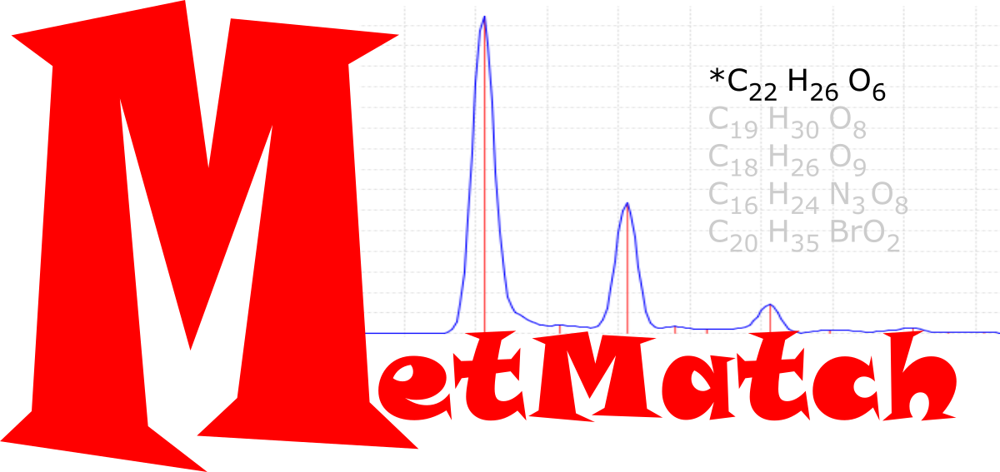

# MetMatch


MS1 Global Search Engine for Feature to Formula Matching 

MetMatch is a MS1 search engine for global mass spectrometry feature to formula matching. MetMatch takes as input a user supplied list of formula and features produced from the XCMS/CAMERA feature finding  and isotope annotation software.  Included are methods to build a target feature library (TFL), preprocessing routines, running the metmatch algorithm, and postprocessing routines. In this vignette you will find a generic workflow for analyzing the data produced from a replicate mass spectrometry experiment.


###1. Quickstart
For those wanting to dive in, the following commands should allow you to quickly analyze a single mzxml file.  MetMatch was developed with a replicate series of MS samples, and users are encouraged to read further for analyzing replicate sets of MS metabolomics data.
```
#1. Read the list of formulae to build the TFL
formulae = read.delim("formulae.txt")


#2. Build the TFL (database)
TFL = build.TFL.emass(k=6,formulae)

#3. run XCMS, enter your own mzXML file
xs = xcmsSet("data.mzXML",method="massifquant",withWave=1,ppm=10,
              prefilter=c(3,300),peakwidth=c(3,45),snthresh=1.25)


#4. Run CAMERA to annotate isotopes

#Wrapper function
getIsotopes = function(x){
  require(CAMERA)
  an = xsAnnotate(x)
  an = groupFWHM(an,sigma=3)
  an = findIsotopes(an,maxiso=6, ppm=5, mzabs=0.02)
  an = groupCorr(an,calcIso=TRUE)
  getPeaklist(an)
 }

pl = getPeakList(xs)\n
write.csv(file="isotopes.cam.csv",pl)

#5. Convert camera file to query list
Q = convert.camera.file("isotopes.cam.csv",1)

#6. Run MetMatch!
res = metmatch(Q.data,TFL,score.method="best",run.type="nodecoy",out.file.name="results")
```

###2. Target Feature Library
Target Feature Libraries (TFL) are the samplewise specific databases (herein called a search-space) and are one of the two required inputs for MetMatch.  Building a TFL can take several minutes to hours depending on the number of formulae, but is completed once for a list of unique formulae expected to be encountered in a sample.  For our example, formulae are derived from the Human metabolome database and LipidMaps, since our samples are derioved from a human cell line.  Additionally, once the TFL is built, the user has the option of saving the TFL to text for later rapid loading.  Routines can be scripted to remove or add TFL entries simply by running the build command, writing to text the new TFL entries, and inserting these entries into the searchspace text file.

#####Building the TFL
A list of formulae is required to initiate the TFL building proces. We then initiate the TFL build. k is the expected maximum number of isotopes (we use 6).  Before running this, please realize that a precompiled searchspace has been built to save the user time (see below):

```
formulae = read.delim("formulae.txt")
TFL = build.TFL.emass(k=6,formulae,nCore=64)
```
#####Writing TFLs and Reading pre-built TFLs}
Two simple commands are provided to write and read the TFL:

```
write.TFL(file="TFL.txt")
read.TFL(file="TFL.txt")
```


The format of each entry in the TFL text file is <\# formula \#peaks> on the first line followed by the isotopic information: <Formula monoisotopic mass, \#peaks, isotope exact mass, isotope relative abundance>.
```
#  C7H11N3O2 6
C7H11N3O2	169.08457	6	169.08457	0.909003
C7H11N3O2	169.08457	6	170.08722	0.083435
C7H11N3O2	169.08457	6	171.08928	0.007122
C7H11N3O2	169.08457	6	172.09161	0.000421
C7H11N3O2	169.08457	6	173.09385	1.9e-05
C7H11N3O2	169.08457	6	174.09607	1e-06
#  C3H10N2 5
C3H10N2	74.08384	5	74.08384	0.958645
C3H10N2	74.08384	5	75.08621	0.04068
C3H10N2	74.08384	5	76.08824	0.00067
C3H10N2	74.08384	5	77.08985	5e-06
C3H10N2	74.08384	5	78.0911	0
```

###3. MS Data Preprocessing
#####Peak finding with XCMS
By this time in the data analysis, the user will preprocess data to find isotopic clusters (features).  It is recommended to use the ProteoWizard MSConvert.exe tool to convert to mzXML. The pipeline is run using mzXML formatted files, but it is assumed that anyformat compatible with XCMS can be used.  Once peak finding is completed, the resultant peaks are grouped into isotope clusters using CAMERA. These steps by far are the most time consuming steps in the MetMatch pipeline.

```
mzxml = dir("HEK293_DATA",pattern=".mzXML$",full.names=T)
mzxml

# Single sample
xs = xcmsSet(mzxml,method="massifquant",withWave=1,ppm=10,
              prefilter=c(3,300),peakwidth=c(3,45),snthresh=1.25)

# Multiple samples
# Use lapply for more than one sample
#   (or alternatively multi thread using mclapply)
xs  = mclapply(mzxml,function(x) xcmsSet(x,method="massifquant",
            withWave=1,ppm=10,prefilter=c(3,300),peakwidth=c(3,45),
            snthresh=1.25),nCore=6)
```

At this time the XCMS set is ready for feature finding using the CAMERA package.

#####Finding isotope clusters with CAMERA
The next step involves using a wrapper function to find isotopes in the dataset. The user is expected to have some working knwoledge of the settings in CAMERA.  The peaklists are written to a csv file and can be analyzed later with the MetMatch algorithm.

```
getIsotopes = function(x){
 require(CAMERA)
 an <- xsAnnotate(x)
 an = groupFWHM(an,sigma=3)
 an = findIsotopes(an,maxiso=6, ppm=5, mzabs=0.02)
 an = groupCorr(an,calcIso=TRUE)
 getPeaklist(an)
}

pl = mclapply(xs,function(x)getIsotopes(x),nCore=6)
filenames  = sub(".mzXML",".cam.csv",mzxml)
i=1
for(p in pl){
  write.csv(file = filenames[i],p)
  i=i+1
}
```

### 4. Performing Feature to Formula Matching (FFM) using the MetMatch search engine
After data preprocessing, the features have been written to comma delimited format (.csv) and are ready to read and convert to a format that MetMatch can search. This is a simple, two step process: 1) read and convert the CAMERA output to a list of query features containing isotopic masses and intensities, and 2)Run the metmatch algorithm.

#####Convert the CAMERA output to queryable features
convert.camera.file is a function that will read and convert the csv file.
```
cameraFiles = dir(pattern="\\.cam.csv$",full.names=T)
Q = lapply(cameraFiles, function(x) convert.camera.file(x,1))
```
#####Running MetMatch
MetMatch requires the user to set the ppm and intensity tolerances.  The most important setting here is the mass setting.  To model delta mass and delta intensities correctly, use a wide enough mass tolerance to help model incorrect matches. FOr example, in QTOF data metabolites with mass error of less than 10ppm are routinely acquired, however we use a 50ppm mass tolerance window.  Intensity tolerances are on a scale of 0-1, and a setting of 0.5 will work for most data.  MetMatch takes as input the query list of experiemntal isotopes (Q), and the target feature library. Please see the manual for details on specific settings in the MetMatch function.

First convert the CAMERA files and load into a list of query objects:

```
cameraFiles = dir(pattern="\\.cam.csv$",full.names=T)
Q = lapply(cameraFiles, function(x) convert.camera.file(x,1))
```

Then run MetMatch:
```
filenames = sub(".cam.csv","",cameraFiles)
res = list()
i=1
for(Q.data in Q){
   res[[i]] = metmatch(Q.data,TFL,score.method="best",score.type="nodecoy",out.file.name=filenames[i])
   i=i+1
}
```


