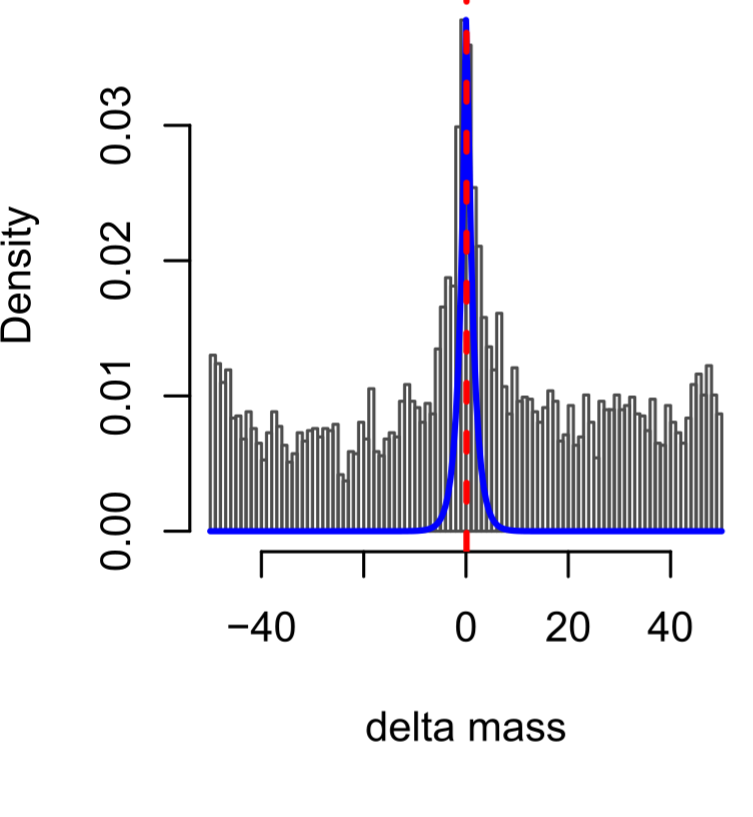
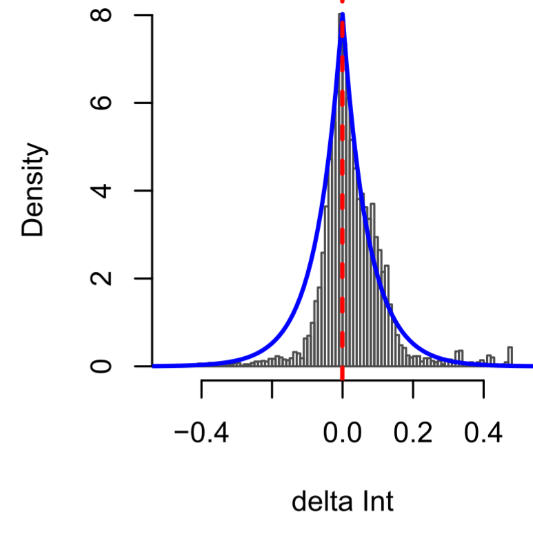
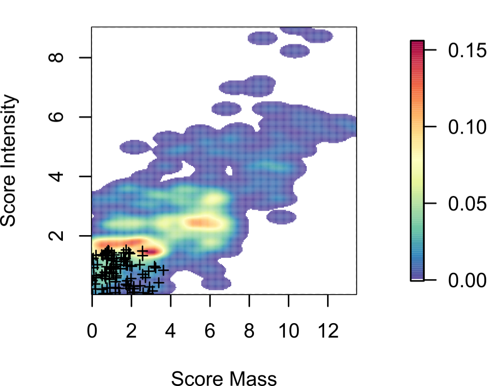
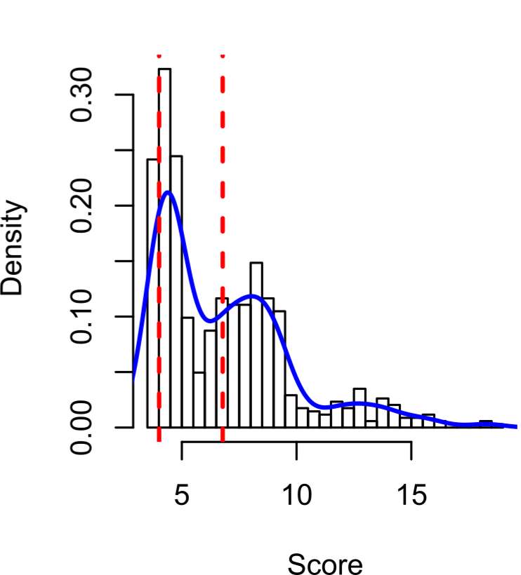

##MS1 Global Search Engine for Feature to Formula Matching 

MetMatch is a MS1 search engine for global mass spectrometry feature to formula matching, developed by Scott Walmsley,PhD (University of Colorado-Anschutz Medical School) and Hyungwon Choi,PhD (National University of Singapore School of Public Heatlh).  MetMatch takes as input a user supplied list of formula and features produced from the XCMS/CAMERA feature finding  and isotope annotation software.  Included are methods to build a target feature library (TFL), preprocessing routines, running the metmatch algorithm, and postprocessing routines. In this vignette you will find a generic workflow for analyzing the data produced from a replicate mass spectrometry experiment.

##Installation
After downloading the compressed archive (tar.gz), install with R as you would any other package:

```
install.packages(path_to_file, repos = NULL, type="source")
```

##Usage
###1. Quickstart
For those wanting to dive in, the following commands should allow you to quickly analyze a single mzxml file.  MetMatch was developed with a replicate series of MS samples, and users are encouraged to read further for analyzing replicate sets of MS metabolomics data.
```
#1. Read the list of formulae to build the TFL
formulae = read.delim("formulae.txt")

#2. Read the TFL (database)
data(TF)

#3. run XCMS/CAMERA:
wd = "<Path to your folder containing the mzxml file(s)>"
run.CAMERA(wd)

#4. Run MetMatch!
run.metmatch(wd,DB)

#5. Open your results files!
```

###2. Target Feature Library
Target Feature Libraries (TFL) are the samplewise specific databases (herein called a search-space) and are one of the two required inputs for MetMatch.  Building a TFL can take several minutes to hours depending on the number of formulae, but is completed once for a list of unique formulae expected to be encountered in a sample.  For our example, formulae are derived from the Human metabolome database and LipidMaps, since our samples are derioved from a human cell line.  Additionally, once the TFL is built, the user has the option of saving the TFL to text for later rapid loading.  Routines can be scripted to remove or add TFL entries simply by running the build command, writing to text the new TFL entries, and inserting these entries into the searchspace text file.

#####Building the TFL
A list of formulae is required to initiate the TFL building proces. After reading formulae, a simple command is provided to clean the formulae of unwanted entries (deuterated, containing R groups, single atom entries, etc...). We then initiate the TFL build. k is the expected maximum number of isotopes (we use 6).  Before running this, please realize that a precompiled searchspace has been built to save the user time (see below):

```
formulae = read.delim("formulae.txt")
formulae = clean.formulae(formulae)
TFL = build.TFL.emass(k=6,formulae,nCore=64)
```
#####Writing TFLs and Reading pre-built TFLs}
Two simple commands are provided to write and read the TFL:

```
write.TFL(file="TFL.txt")
read.TFL(file="TFL.txt")
```
Or you can use our precompiled library (HMDB+Lipidmaps):
```
data(TFL)
```

The format of each entry in the TFL text file is <\# formula \#peaks> on the first line followed by the isotopic information: <Formula monoisotopic mass, \#peaks, isotope exact mass, isotope relative abundance>.
```
#  C7H11N3O2 6
C7H11N3O2	169.08457	6	169.08457	0.909003
C7H11N3O2	169.08457	6	170.08722	0.083435
C7H11N3O2	169.08457	6	171.08928	0.007122
C7H11N3O2	169.08457	6	172.09161	0.000421
C7H11N3O2	169.08457	6	173.09385	1.9e-05
C7H11N3O2	169.08457	6	174.09607	1e-06
#  C3H10N2 5
C3H10N2	74.08384	5	74.08384	0.958645
C3H10N2	74.08384	5	75.08621	0.04068
C3H10N2	74.08384	5	76.08824	0.00067
C3H10N2	74.08384	5	77.08985	5e-06
C3H10N2	74.08384	5	78.0911	0
```

###3. MS Data Preprocessing
#####Peak finding with XCMS/CAMERA
By this time in the data analysis, the user will preprocess data to find isotopic clusters (features).  It is recommended to use the ProteoWizard MSConvert.exe tool to convert to mzXML. The pipeline is run using mzXML formatted files, but it is assumed that anyformat compatible with XCMS can be used.  Once peak finding is completed, the resultant peaks are grouped into isotope clusters using CAMERA. The user is expected to have some working knwoledge of the settings in CAMERA.  The peaklists are written to a csv file and can be analyzed later with the MetMatch algorithm.  These steps by far are the most time consuming steps in the MetMatch pipeline.  We provide a wrapper function to perform this task.

```
run.CAMERA(wd)
```

### 4. Performing Feature to Formula Matching (FFM) using the MetMatch search engine
After data preprocessing, the features have been written to comma delimited format (.csv) and are ready to read and convert to a format that MetMatch can search. This is a simple, two step process: 1) read and convert the CAMERA output to a list of query features containing isotopic masses and intensities, and 2)Run the metmatch algorithm.  We provide a wrapper function to run these tasks.
MetMatch requires the user to set the ppm and intensity tolerances.  The most important setting here is the mass setting.  To model delta mass and delta intensities correctly, use a wide enough mass tolerance to help model incorrect matches. FOr example, in QTOF data metabolites with mass error of less than 10ppm are routinely acquired, however we use a defualt 50ppm mass tolerance window.  Intensity tolerances are on a scale of 0-1, and the default setting of 0.5 will work for most data.  MetMatch takes as input the query list of experimental isotopes (Q), and the target feature library created earlier. Please see the manual for details on specific settings in the MetMatch function.

```
wd = <relative or full path to directory of experimental files>
run.metmatch(wd,TFL)
```
### 5. Estimating the FFM error rate
In the metmatch algorithm, the FFM error rate is computed by running the "decoy" option for either the run.metmatch  wrapper function, or within the metmatch function itself.  This biggest disadvantage is that the decoy option takes longer to run (~3 times longer than without the "decoy" option).   The advantage, however, is similar to a decoy peptide database in it's usage with proteomics MSMS search engines, metmatch also utilizes a similar approach to aid determining the cutoff "FFM score" that will be computed for each sample.   This method is adaptive to the quality of the sample's features, and consistent in producing cutoffs (ideal minimum scores) between similar samples. 
#####Decoy Feature Library Contruction
The DFL is constructed automatically by learning the correct parameters for DFL construction from the samples themselves.  Specifically, models computed from the isotope delta masses and intensities are used to parameterize the DFL contruction.   More details can be found in the manuscript online methods (coming soon). We chose to construct 5 DFL entries per TFL entry to increase the precision in computing the threshold, especially since the TFL database is only ~13000 entries small. 
#####Determining the cutoff score
The minimum score required or "trusted" by the experimentor is computed within the metmatch algorithm.   Just simply use the "decoy" option and a small text file with the extension ".cutoff.txt" will be produced for each file searched in your working directory.   The results will include scores for FDR of 1 and 5%, and are plotted in the diagnostic plots showing the distribution of scores (see below).  Typically, a 5% FDR has been indicative of a good quality FFM.
To compute your FDR, simply run the decoy option:
For all files in a working directory:
```
wd = <relative or full path to files>
run.metmatch(wd,TFL,run.type="decoy")
```

Or optionally, for advanced users who want fine grain control over the metmatch algorithm:
```
metmatch = function(Q.data,TFL,run.type = "decoy",out.file.name)
```
-->Cutoff scores produced will be in the cutoffs.txt file.

### 6. Interpreting search results
MetMatch produces a table of results together with a plot or results for visualizing the delta models and the final score.  The tables are fairly comprehensive, however the most important columns to the typical experimentor will be the "query" ion, mz, and retention time, assigned formula, and the relevant score.  These tables are indicated with the extenstion ".metab.csv".   
#####Plots
Four diagnostic plots are included. The first two (A and B) are plots of the delta isotope masses and delta isotope intensities from the entire sample.   These have a Laplace distribution fit to them.  They indicate nearest the peak which FFMs are likely "good" FFMs versus the rest which are bad. The log ratio score for each FFM is computed from this distribution over the mean of the remaining "bad" delta masses and intensities.   The third plot (C) shows a heatmap distribution of these scores, which when added become the feature's final score. The final distribution of scores (D) for a sample are shown.  When the "decoy" option is run, the decoy FFMs (indicating a false hit) are shown as "+"'s in plot C and are used to compute the FDR and derive a cutoff score for 1 and 5% FDR (red dash lines in plot D).

###Plot A. Delta Masses


###Plot B. Delta Intensities


###Plot C.  Mass Scores vs. Intensity Scores


###Plot D. Distribution of FFM scores with smooth line fitted (blue)


